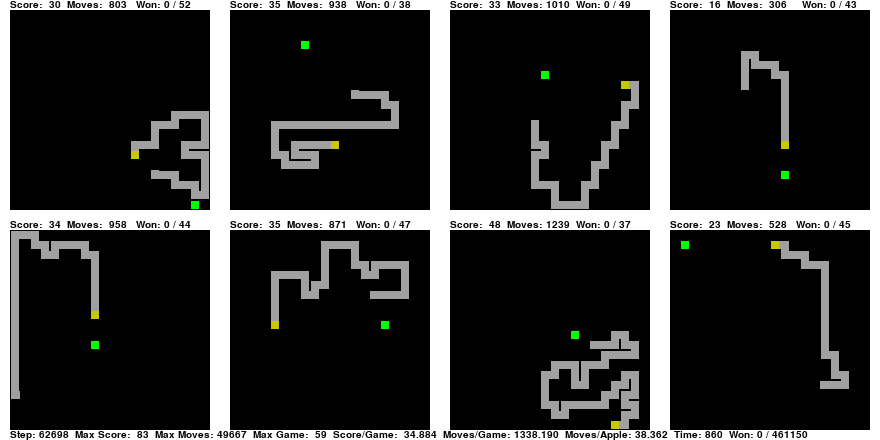

# A.I. Snakes

This is a project to experiment with A.I. algorithms that play [the classical game of snake](https://en.wikipedia.org/wiki/Snake_%28video_game_genre%29).

It runs many snakes at the same time (without threading) to give the A.I. better feedback and displays a few of them to visually show how things are going.

On my system i can run 100000 snakes at more than 60 steps per second on one CPU giving me effectively 6000000 snake steps per second.



## Getting Started

These instruction assume a linux system. Other modern operating systems should
work too but are untested.

I prefer to deploy in a python environment based on [Conda](https://conda.io).
In case you don't have such an environment yet you can set up Miniconda by following the instructions at https://conda.io/en/latest/miniconda.html

At the time of writing the following steps work on linux:

```
wget https://repo.anaconda.com/miniconda/Miniconda3-latest-Linux-x86_64.sh
# I answered all prompt with the defaults
sh Miniconda3-latest-Linux-x86_64.sh
```

Now that you have [Conda](https://conda.io), go to the directory where you cloned this git repository.

```
# cd <your snake directory>
ls -l environment.yml
```

Notice that the file `environment.yml` is a symbolic link and currenly
links to `conda-requirements-gpu.yml`. This assumes you have an Nvidia GPU. If
this is not the case please make `environment.yml` link to `conda-requirements.yml` instead.

Now you can do:

```
source ~/miniconda3/bin/activate
conda env create -f environment.yml
conda activate snake
```

In the future you won't have to do any of that again. To resume work just do:

```
# activate the environment
source ~/miniconda3/bin/activate snake
```

and

```
# Go to your working tree
# cd <your snake directory>
```

(in any order, the activation of the environment has no connection with your current directory)

## Simple test

Check if your setup works by simply doing:

```
./snake.py
```

(You can quit by closing the window or pressing `Q`)

## Command line

Get the usage syntax with

```
./snake.py -h
```

Which at the time of writing outputs:

```
Snakes

Usage:
  snake.py greedy [--snakes=<snakes>] [--debug] [--stepping] [--fps=<fps>]
           [--width=<width>] [--height=<height>] [--frames=<frames>]
           [--columns=columns] [--rows=rows] [--block=<block_size>]
           [--wall=<wall>] [--pygame] [--dump-file=<file>] [--log-file=<log>]
  snake.py q-table [--snakes=<snakes>] [--debug] [--stepping] [--fps=<fps>]
           [--width=<width>] [--height=<height>] [--frames=<frames>]
           [--columns=columns] [--rows=rows] [--block=<block_size>]
           [--wall=<wall>] [--symmetry] [--single] [--pygame]
           [--vision-file=<file>] [--dump-file=<file>] [--log-file=<log>]
           [--learning-rate=<r>] [--discount <ratio>] [--accelerated]
  snake.py -f <file>
  snake.py benchmark
  snake.py (-h | --help)
  snake.py --version

Options:
  -h --help               Show this screen
  --version               Show version
  --stepping              Start in paused mode, wait for the user to press SPACE
  --fps=<fps>             Frames per second (0 is no delays) [default: 40]
  --snakes=<snakes>       How many snakes to run at the same time [default: 0]
                          0 means use rows * colums or 1
  --block=<block_size>    Block size in pixels [default: 20]
  --width=<width>         Pit width  in blocks [default: 40]
  --height=<height>       Pit height in blocks [default: 40]
  --columns=<columns>     Columns of pits to display [default: 2]
  --rows=<rows>           Rows of pits to display [default: 1]
  --frames=<frames>       Stop automatically at this frames number [Default: -1]
  --wall=<wall>           Have state for distance from wall up to <wall>
                          [Default: 2]
  --symmetry              Apply dihedral symmetry
  --pygame                Use pygame for output
  --vision-file=<file>    Read snake vision from file
  --log-file=<file>       Write to logfile. Use an empty string if you
                          explicitely don't want any logging
                          [Default: snakes.log.txt]
  --dump-file=<file>      Which file to dump to on keypress
                          [Default: snakes.dump.txt]
  --single                Any one state can be updated at most once per frame
                          Use this if all snakes tend to be in different states
                          since it allows you to use an undivided learning rate
                          (only reasonable if there are many states relative to
                          the number of snakes)
  -l --learning-rate=<r>  Learning rate
                          (will be divided by number of snakes if not --single)
                          [Default: 0.1]
  --discount <ratio>      state to state Discount [Default: 0.99]
  --debug                 Run debug code
  --accelerated           Prefill the Q table with walls
                          It will learn this by itself but takes a long time if
                          there are very many states
  -f <file>:              Used by jupyter, ignored

Key actions:
  s:          enter pause mode after doing a single step
  r, SPACE:   toggle run/pause mode
  Q, <close>: quit
  +:          More frames per second (wait time /= 2)
  -:          Less frames per second (wait time *= 2)
  =:          Restore the original frames per second
  d:          Toggle debug
  D:          Dump current state (without snake state)
  c:          Capture window (currently pygame only)
  C:          Toggle window stream (currently pygame only)
              Post processing examples:
               Make movie:
                 ffmpeg -y -f rawvideo -s 200x200 -pix_fmt rgb24 -r 40 -i snakes.stream.200x200.rgb -an -vcodec h264 snakes.mp4
               Make gif:
                 ffmpeg -y -f rawvideo -s 880x440 -pix_fmt rgb24 -r 10 -i snakes.stream.880x440.rgb -an -vf palettegen palette.png
                 ffmpeg -y -f rawvideo -s 880x440 -pix_fmt rgb24 -r 10 -i snakes.stream.880x440.rgb -i palette.png -an -lavfi paletteuse snakes.gif
```

### Greedy mode

This is not really an A.I but a baseline to compare others to

The snake simply takes the shortest path to the food.
If this would cause a crash it takes a random non-crashing step instead.
If all moves crash it selects one of these at random.

### Q table mode

Learns using a simple [Q table](https://en.wikipedia.org/wiki/Q-learning) on a restricted view

## License

This project is licensed under [GPLv3](https://www.gnu.org/licenses/gpl-3.0.en.html)
